# Gomoku Server - Sequence Diagrams

This document contains detailed sequence diagrams for the Gomoku game server architecture, including the new UI monitoring features and worker load balancing system.

---

## 1. Server Startup with UI Monitoring

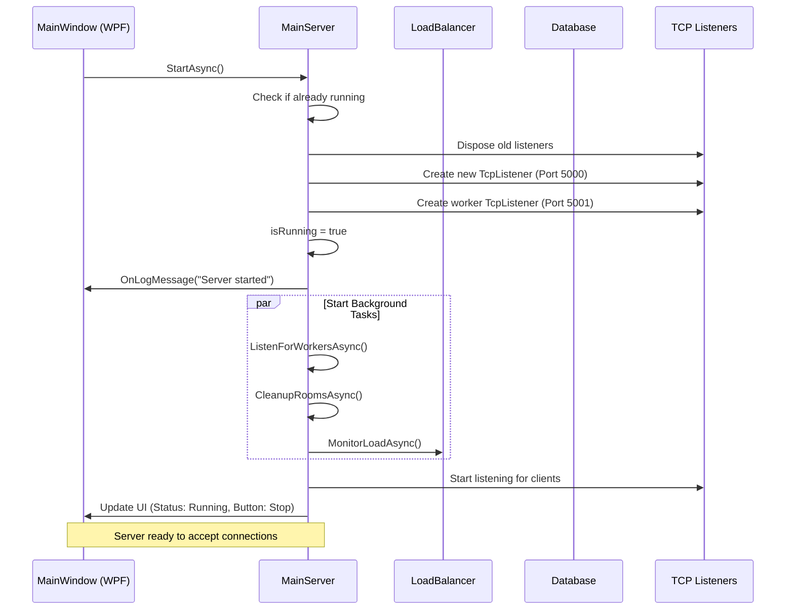

---

## 2. Worker Connection & Status Tracking

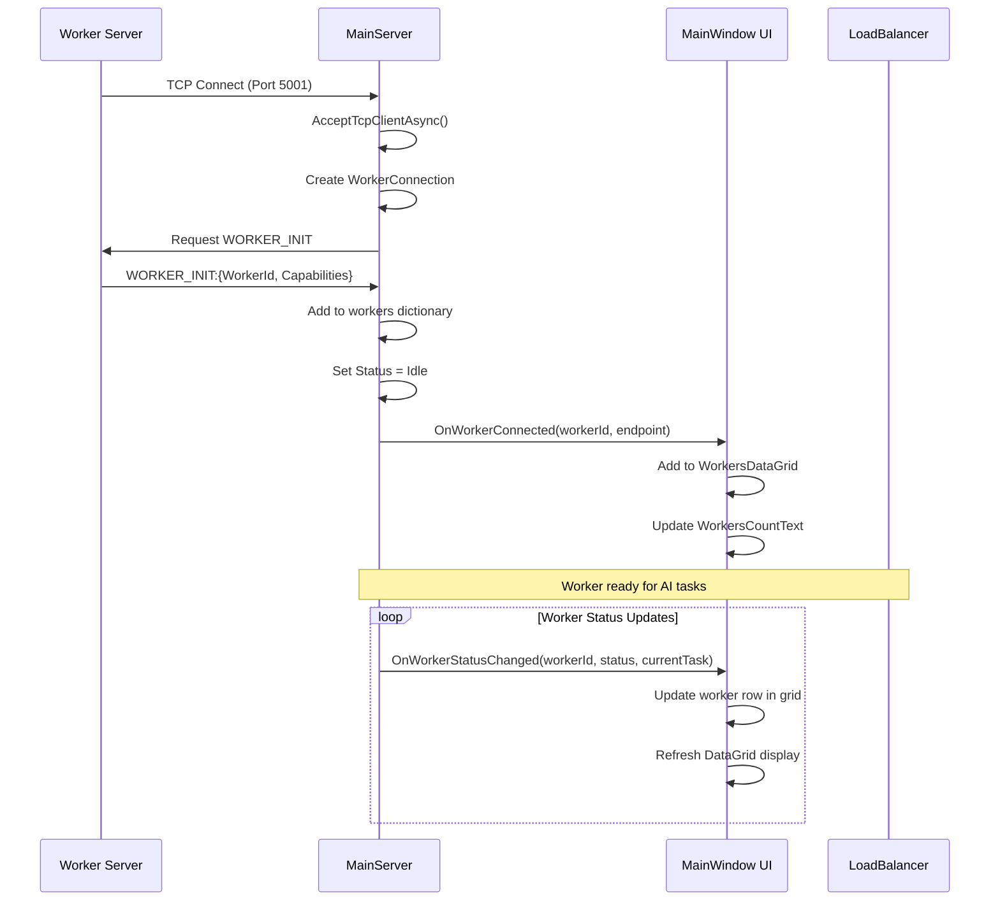

---

## 3. Client Authentication with UI Update

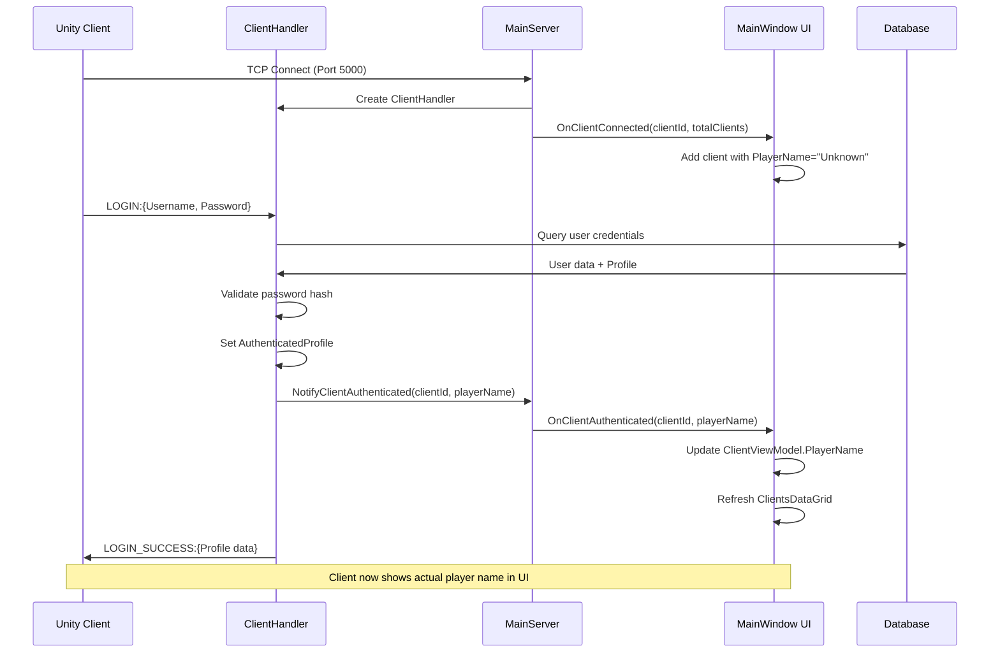

---

## 4. Client Logout with UI Reset

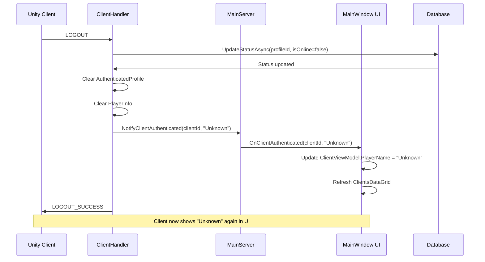

---

## 5. PvP Matchmaking with Room Tracking

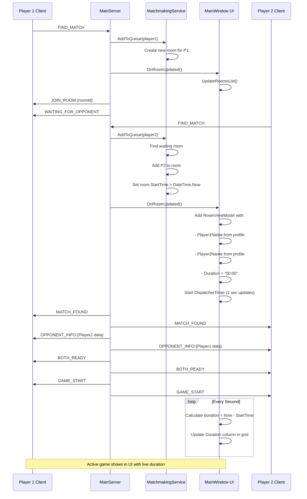

---

## 6. AI Game with Worker Load Balancing

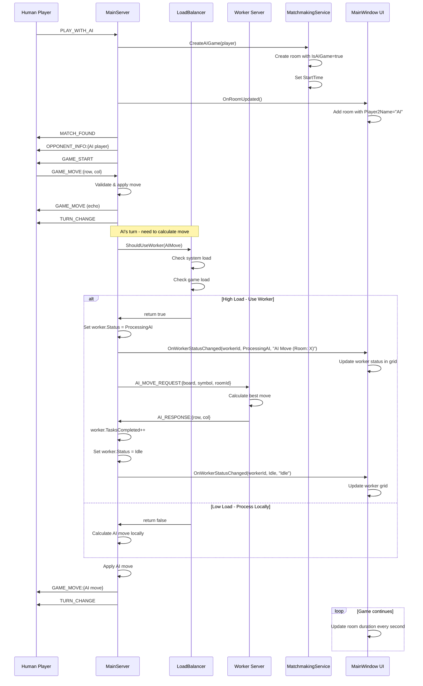

---

## 7. Game End with Statistics Recording

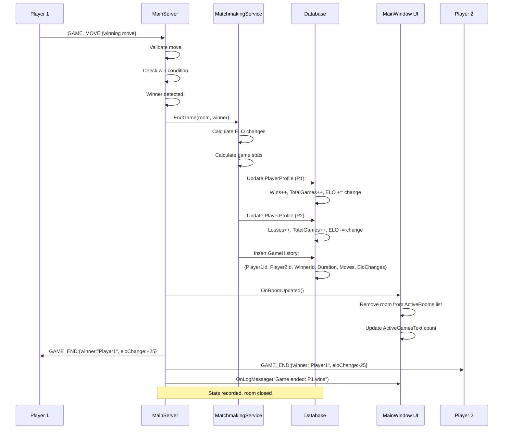

---

## 8. Server Stop with Cleanup

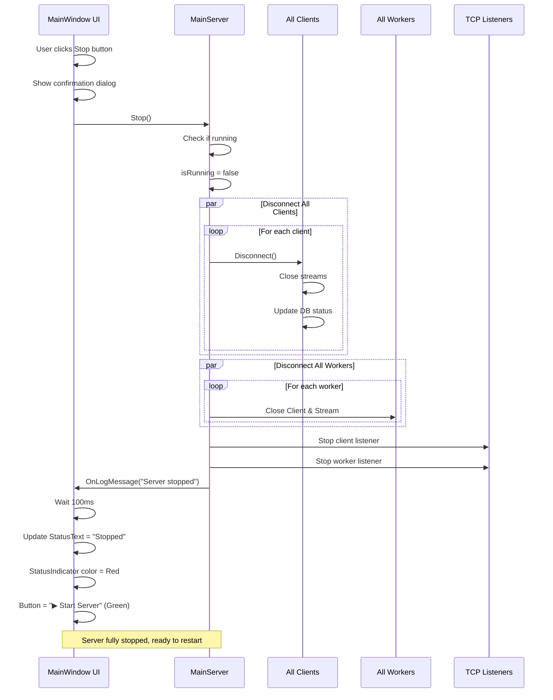

---

## 9. Server Restart with Data Clear

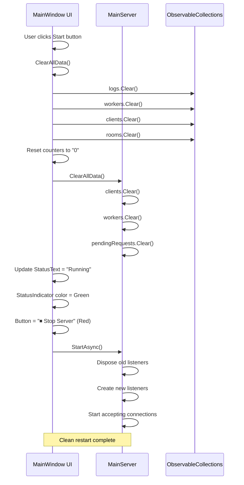

---

## 10. Real-time UI Monitoring

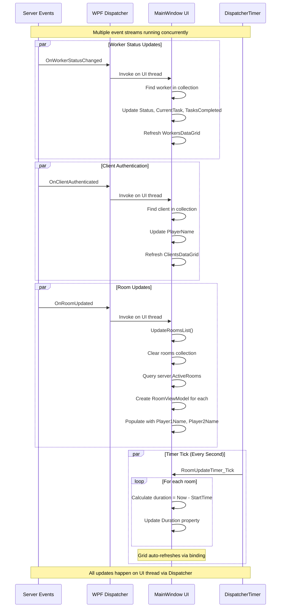

---

## 11. Load Balancing Decision Flow

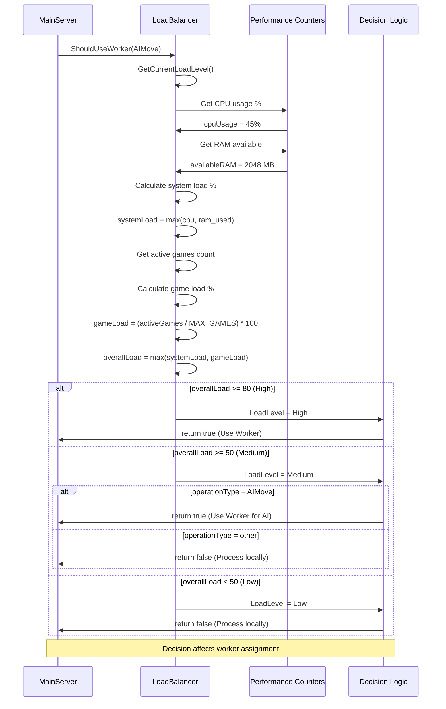

---

## 12. Friend System with Real-time Updates

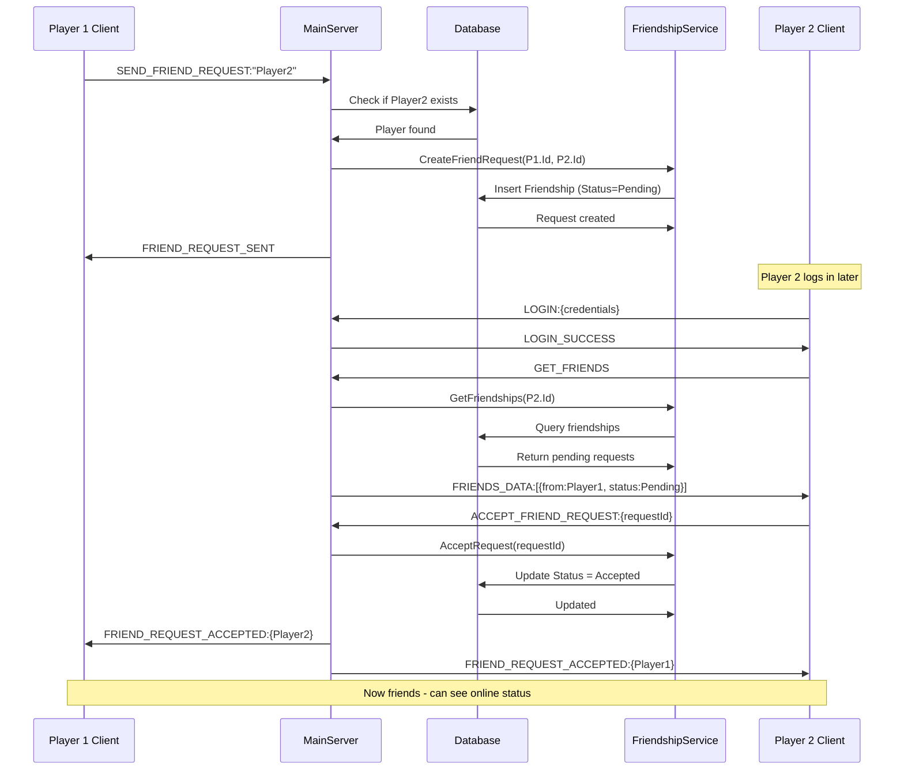

---

## 13. Leaderboard & Statistics Query

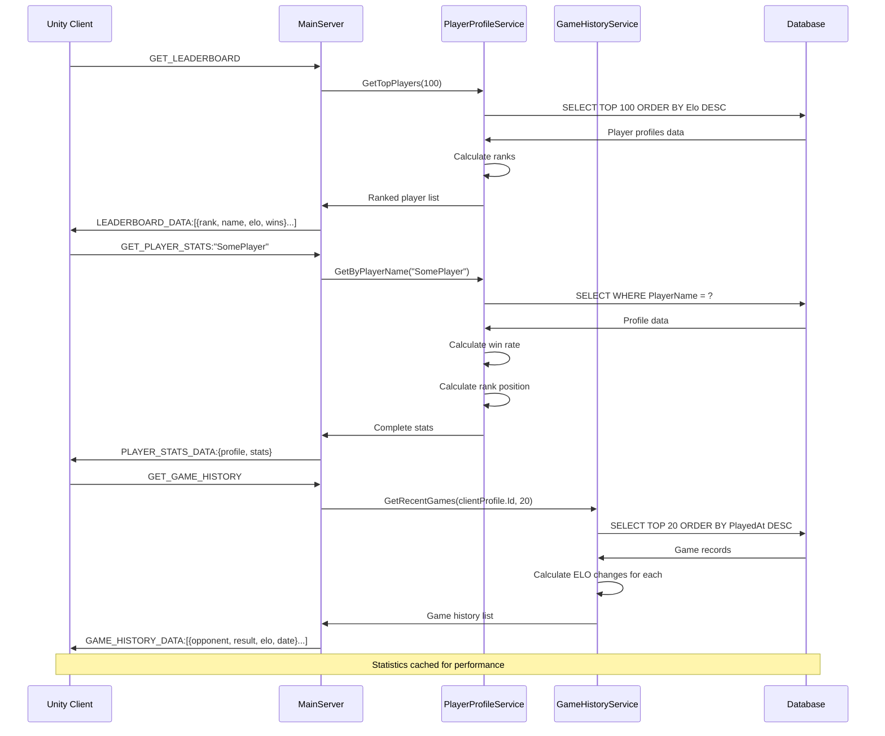

---

## Notes

### Key Improvements in New Architecture:

1. **Real-time UI Monitoring**
   - Event-driven updates via Dispatcher
   - Live worker status tracking
   - Active game room monitoring with duration
   - Client authentication state updates

2. **Worker Load Balancing**
   - Performance counter monitoring
   - Intelligent task distribution
   - Worker status tracking (Idle/ProcessingAI/Busy)
   - Task completion metrics

3. **Clean Server Lifecycle**
   - Proper connection cleanup on Stop
   - Full data reset on Start
   - Toggle Start/Stop button functionality
   - Graceful client/worker disconnection

4. **Enhanced Game Tracking**
   - Room creation timestamps
   - Live duration calculation
   - Player name resolution
   - Active game statistics

5. **Thread-Safe UI Updates**
   - All UI updates via Dispatcher.Invoke
   - ObservableCollection for data binding
   - DispatcherTimer for periodic updates
   - Event-based notification system

### Technologies Used:
- **.NET 8.0** with WPF for UI
- **TCP Sockets** for client/worker communication
- **SQL Server LocalDB** with EF Core
- **ConcurrentDictionary** for thread-safe collections
- **Performance Counters** for load monitoring
- **Event-driven architecture** for real-time updates
